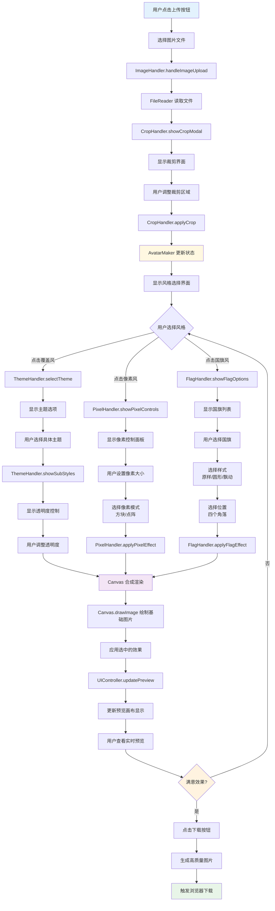
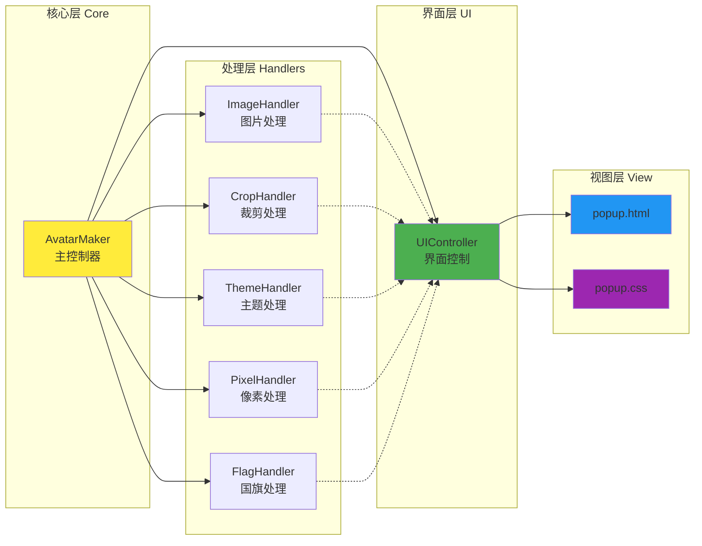

# FuncAvatar - 功能强大的头像制作工具

一个功能丰富的Chrome浏览器插件，支持多种头像制作风格，包括主题覆盖、像素风格和国旗风格。

## 📖 项目简介

**FuncAvatar** 是一款专为个性化头像制作而设计的Chrome浏览器扩展程序。它集成了多种创意风格处理功能，让用户能够轻松地将普通头像转换为独特的艺术作品。

### 🎯 设计理念
- **简单易用**：直观的界面设计，三步即可完成头像制作
- **功能丰富**：涵盖节日主题、复古像素、国旗装饰等多种风格
- **高质量输出**：支持800x800高分辨率下载，确保清晰度
- **隐私安全**：所有处理均在本地完成，保护用户隐私

### 🌟 核心优势
- **🚀 即装即用**：无需注册登录，安装后立即可用
- **🎨 风格多样**：三大类别，数十种风格选择
- **⚡ 实时预览**：所见即所得的编辑体验
- **📱 响应式设计**：适配不同屏幕尺寸
- **🔧 技术先进**：基于Manifest V3，使用最新Web技术

### 🎪 适用场景
- **社交媒体**：为微信、QQ、微博等平台制作个性头像
- **节日庆祝**：快速制作节日主题头像
- **游戏娱乐**：创建复古像素风格的游戏头像
- **爱国表达**：添加国旗元素展示爱国情怀
- **创意设计**：为设计师提供快速原型制作工具

## 🌟 主要功能

### 🎨 主题覆盖风格
- **春节主题** 🧧：添加春节元素装饰
- **中秋主题** 🌕：中秋节庆装饰效果
- **生日主题** 🎂：生日庆祝装饰
- **国庆主题** 🎊：国庆节庆装饰
- **自定义主题**：支持上传自定义装饰图片
- **透明度调节**：可调整装饰效果的透明度

### 🎮 像素风格
- **像素化处理**：将头像转换为复古像素风格
- **像素大小调节**：支持1-20像素的自定义大小
- **白色像素忽略**：可选择忽略白色像素，保持透明效果
- **实时预览**：即时查看像素化效果

### 🏳️ 国旗风格
- **丰富的国旗选择**：支持全球200+个国家和地区的国旗
- **多种样式**：
  - 圆形样式：带白边的圆形国旗
  - 原样式：保持国旗原始比例
  - 飘动样式：带有飘动动画效果的国旗
- **灵活定位**：支持四个角落的位置选择
- **高质量输出**：支持高分辨率下载

## 📁 项目结构

```
FuncAvatar/
├── manifest.json          # 插件配置文件
├── background.js          # 后台服务脚本
├── popup.html            # 插件弹窗界面
├── popup.css             # 插件专用样式
├── js/                   # JavaScript模块
│   ├── init.js           # 初始化脚本
│   ├── core/             # 核心模块
│   │   └── AvatarMaker.js # 主控制器类
│   ├── handlers/         # 功能处理模块
│   │   ├── ImageHandler.js    # 图片处理
│   │   ├── CropHandler.js     # 图片裁剪
│   │   ├── ThemeHandler.js    # 主题覆盖
│   │   ├── PixelHandler.js    # 像素风格
│   │   └── FlagHandler.js     # 国旗风格
│   └── ui/               # UI控制模块
│       └── UIController.js    # 界面控制器
├── icons/                # 插件图标
│   ├── logo16.png
│   ├── logo32.png
│   ├── logo48.png
│   └── logo128.png
├── images/               # 主题图片资源
│   ├── chunjie1.png      # 春节主题1
│   ├── chunjie2.png      # 春节主题2
│   ├── guoqing1.png      # 国庆主题1
│   ├── guoqing2.png      # 国庆主题2
│   ├── guoqing3.png      # 国庆主题3
│   ├── guoqing4.png      # 国庆主题4
│   ├── shengdan1.png     # 圣诞主题1
│   ├── shengdan2.png     # 圣诞主题2
│   ├── shengri1.png      # 生日主题
│   └── zhongqiu1.png     # 中秋主题
├── flag/                 # 标准国旗图片
│   ├── cn.png           # 中国国旗
│   ├── us.png           # 美国国旗
│   └── ...              # 其他200+国旗
├── flag-fly/             # 飘动效果国旗图片
│   ├── cn.png           # 中国飘动国旗
│   ├── us.png           # 美国飘动国旗
│   └── ...              # 其他200+飘动国旗
└── README.md             # 说明文档
```

## 🚀 快速开始

### 📦 安装方法
1. 下载项目文件到本地
2. 打开Chrome浏览器，进入扩展程序管理页面 (`chrome://extensions/`)
3. 开启"开发者模式"
4. 点击"加载已解压的扩展程序"
5. 选择项目文件夹
6. 安装完成，点击浏览器工具栏中的插件图标即可使用

### 🎮 使用步骤
1. **📤 上传图片**：点击上传按钮选择头像图片
2. **🎨 选择风格**：在三个标签页中选择喜欢的风格
   - **覆盖风**：选择主题并调整透明度
   - **像素风**：设置像素大小和选项
   - **国旗风**：选择国旗、样式和位置
3. **👀 预览效果**：实时查看处理后的效果
4. **💾 下载保存**：点击下载按钮保存处理后的头像

## 🔧 技术特点

### 架构设计
- **模块化架构**：采用ES6类和模块化设计，代码结构清晰
- **单一职责原则**：每个模块负责特定功能，便于维护和扩展
- **事件驱动**：基于事件监听的交互模式，响应迅速
- **状态管理**：集中式状态管理，确保数据一致性

### 核心技术
- **Manifest V3规范**：使用最新的Chrome扩展标准
- **纯前端实现**：无需服务器，完全本地处理
- **Canvas绘图技术**：高质量的图片处理和合成
- **响应式设计**：适配不同屏幕尺寸
- **多格式支持**：支持JPG、PNG、GIF等常见图片格式
- **高质量输出**：支持800x800像素的高分辨率下载
- **实时预览**：所有操作都有即时预览效果

### 模块说明
- **AvatarMaker**：主控制器，负责整体协调和初始化
- **ImageHandler**：图片上传和基础处理
- **CropHandler**：智能图片裁剪功能
- **ThemeHandler**：主题覆盖和透明度控制
- **PixelHandler**：像素风格处理和效果生成
- **FlagHandler**：国旗风格处理和位置控制
- **UIController**：界面状态管理和用户交互

## 🎯 功能亮点

### 智能图片处理
- 自动1:1比例裁剪，确保头像完美显示
- 智能居中算法，保持主体内容完整
- 高质量缩放，避免图片失真

### 丰富的自定义选项
- 透明度精确控制（0-100%）
- 像素大小灵活调节（1-20像素）
- 国旗位置四角可选
- 多种国旗样式切换

### 用户体验优化
- 直观的标签页设计
- 实时预览反馈
- 一键下载功能
- 错误处理和提示

## 🌍 支持的国家和地区

插件支持全球200+个国家和地区的国旗，包括但不限于：
- 🇨🇳 中国
- 🇺🇸 美国
- 🇬🇧 英国
- 🇯🇵 日本
- 🇰🇷 韩国
- 🇫🇷 法国
- 🇩🇪 德国
- 🇮🇹 意大利
- 🇪🇸 西班牙
- 🇷🇺 俄罗斯
- 以及更多...

## 🔄 更新日志

### v1.0.0 (当前版本)
- ✅ **基础功能完善**
  - 主题覆盖功能：支持春节、中秋、生日、国庆、圣诞等节日主题
  - 像素风格处理：马赛克和点阵两种像素化模式
  - 国旗风格支持：200+国家和地区国旗选择
- ✅ **交互体验优化**
  - 多样式国旗选择：原样、圆形、飘动三种样式
  - 飘动国旗效果：动态视觉效果
  - 实时预览功能：所见即所得的编辑体验
- ✅ **技术架构升级**
  - 高质量图片下载：支持800x800分辨率
  - 响应式界面设计：适配不同屏幕尺寸
  - 模块化代码架构：便于维护和扩展

### 🔮 未来规划
- 🚧 **功能扩展**
  - 更多节日主题支持
  - 自定义滤镜效果
  - 批量处理功能
- 🚧 **体验优化**
  - 快捷键支持
  - 历史记录功能
  - 云端同步选项

## 🛠️ 开发说明

### 项目架构

本插件采用模块化架构设计，主要包含以下核心模块：

#### 系统流程图



#### 模块关系图



#### 核心类 (Core)
- **AvatarMaker** - 主控制器类
  - 负责整体应用的初始化和协调
  - 管理全局状态和各模块间的通信
  - 提供统一的预览更新接口

#### 处理器模块 (Handlers)
- **ImageHandler** - 图片处理器
  - `handleImageUpload(file)` - 处理图片上传
  - `loadImageForCrop(file)` - 加载图片进行裁剪
  - `loadImage(url)` - 异步加载图片

- **CropHandler** - 裁剪处理器
  - `showCropModal(imageSrc)` - 显示裁剪模态框
  - `applyCrop()` - 应用裁剪设置
  - 支持拖拽和缩放的交互式裁剪

- **ThemeHandler** - 主题处理器
  - `selectTheme(theme)` - 选择主题
  - `showSubStyles(theme)` - 显示子样式选项
  - `handleCustomThemeSelect(e)` - 处理自定义主题上传

- **PixelHandler** - 像素风处理器
  - `showPixelControls()` - 显示像素风控制面板
  - `applyPixelEffect(canvas, ctx, size)` - 应用像素化效果
  - 支持方块和点阵两种像素风格

- **FlagHandler** - 国旗处理器
  - `showFlagOptions()` - 显示国旗选项
  - `selectFlagStyle(style)` - 选择国旗样式
  - `applyFlagEffect(canvas, ctx, size)` - 应用国旗效果

#### UI控制器 (UI)
- **UIController** - 界面控制器
  - `handleTabSwitch(tabName)` - 处理标签页切换
  - `showSection(sectionId)` - 显示指定区域
  - `hideSection(sectionId)` - 隐藏指定区域

### 开发环境要求
- Chrome 88+
- HTML5 Canvas API
- ES6+ JavaScript
- CSS3 动画和变换

### 扩展开发
如需添加新功能，建议按以下步骤：
1. 在相应的 handlers 目录下创建新的处理器类
2. 在 AvatarMaker 中初始化新模块
3. 在 popup.html 中添加对应的UI元素
4. 在 popup.css 中添加样式定义

本插件基于原有的网页版头像制作工具改造而成，主要调整包括：

1. **插件化改造**：创建了适合插件弹窗的UI布局
2. **样式优化**：优化了样式以适应较小的显示空间
3. **功能增强**：添加了国旗风格和像素风格
4. **配置完善**：添加了插件必需的配置文件和图标
5. **兼容性提升**：保持了原有的所有功能特性

## 🔒 隐私与安全

### 🛡️ 隐私保护
- **本地处理**：所有图片处理均在本地完成，不上传到任何服务器
- **零数据收集**：不收集用户个人信息和使用数据
- **无网络依赖**：除下载国旗图片外，无需网络连接
- **即用即删**：处理完成后不保留任何用户数据

### 🔐 安全保障
- **权限最小化**：仅申请必要的浏览器权限
- **代码开源**：所有代码公开透明，可供审查
- **无恶意行为**：不访问用户浏览数据和敏感信息
- **标准合规**：符合Chrome扩展安全标准和最佳实践

### 📋 权限说明
- **存储权限**：用于保存用户的风格选择偏好
- **文件访问**：用于读取用户上传的图片文件
- **下载权限**：用于保存处理后的头像图片

## 📄 开源协议

本项目采用 **MIT License** 开源协议，您可以自由地：
- ✅ 使用、复制、修改、合并、发布、分发本软件
- ✅ 将本软件用于商业用途
- ✅ 在遵循协议的前提下重新授权

**唯一要求**：在所有副本中保留原始的版权声明和许可声明。

## 🤝 参与贡献

我们欢迎所有形式的贡献！无论您是开发者、设计师还是普通用户，都可以为项目做出贡献：

### 🐛 报告问题
- 在 [GitHub Issues](https://github.com/your-repo/FuncAvatar/issues) 中报告Bug
- 提供详细的问题描述和复现步骤
- 附上相关的截图或错误信息

### 💡 功能建议
- 提出新功能的想法和建议
- 描述功能的使用场景和预期效果
- 参与功能讨论和设计

### 🔧 代码贡献
- Fork 项目到您的GitHub账户
- 创建功能分支进行开发
- 提交 Pull Request 并描述您的更改
- 确保代码符合项目的编码规范

### 🎨 设计贡献
- 提供UI/UX改进建议
- 设计新的主题图片和图标
- 优化用户界面和交互体验

## 📞 联系我们

如有任何问题、建议或合作意向，欢迎通过以下方式联系：

- **GitHub Issues**：[项目问题追踪](https://github.com/your-repo/FuncAvatar/issues)
- **GitHub Discussions**：[社区讨论区](https://github.com/your-repo/FuncAvatar/discussions)
- **Email**：your-email@example.com

---

<div align="center">

**⭐ 如果这个项目对您有帮助，请给我们一个Star！⭐**

Made with ❤️ by FuncAvatar Team

</div>